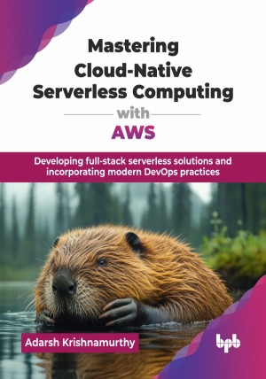

# Mastering Cloud-Native Serverless Computing with AWS

Developing full-stack serverless solutions and incorporating modern DevOps practices.

This is the repository for [Mastering Cloud-Native Serverless Computing with AWS
](https://bpbonline.com/products/mastering-cloud-native-serverless-computing-with-aws?variant=44754163695816),published by BPB Publications.

## About the Book
Cloud computing has become the backbone of modern computing. Cloud is the driving force for innovation in all industries and sectors. Any new technology, invention, or advancement can be directly or indirectly contributed to the cloud. Amazon Web Services (AWS) is the pioneer and the world’s largest public cloud provider with the highest number of services to solve any problem. Cloud-native and serverless paradigms make developing systems and applications easier while making them highly resilient, infinitely scalable, secure, and still cost-efficient.

This book provides everything required to understand core AWS services in each aspect of computing. This helps in understanding the key services, what problems they solve, and how they can be used in conjunction with other services. The book uncovers the ways to assemble these components into a cohesive whole. The practical and industry-specific examples and use cases help the users grasp the concepts and see how they can be used across industries and sectors to solve complex business problems. The practical approach will help readers get an insight into cloud computing with the serverless, cloud-native flavor.

By the end of this book, the readers will be equipped to choose the right architectural style, service, and paradigm to design and develop applications on the cloud. This extends beyond general theoretical knowledge to industry-specific constructs, applications, and unique challenges faced by industries. The learning can be imparted to any sector to solve complex problems innovatively.

## What You Will Learn
• Understand core AWS services and their problem-solving applications.

• Assemble various AWS components into cohesive cloud solutions.

• Design and develop applications using cloud-native and serverless paradigms.

• Grasp practical, industry-specific examples and use cases of AWS.

• Choose appropriate architectural styles and services for cloud applications.

• Solve complex business problems across sectors with innovative cloud solutions.
